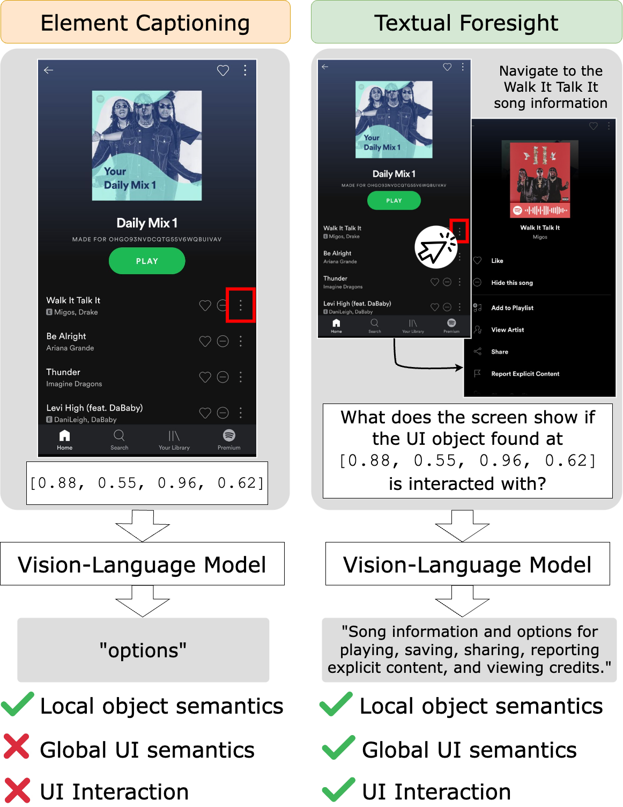
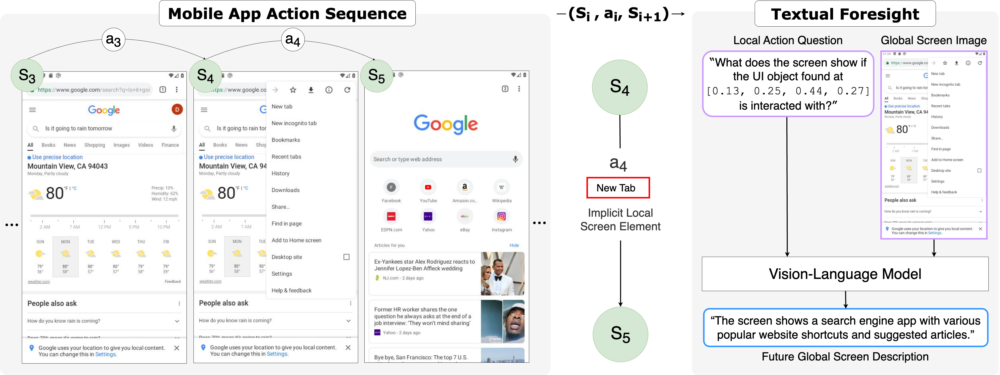

# Tell Me What's Next: Textual Foresight for Generic UI Representations

<div style="display: flex; justify-content: space-between; align-items: center;">

<div style="width: 45%;">
<a href="url"></a>
</div>

<div style="width: 55%; padding-left: 20px;">
This repository contains the modeling and data processing code for <i>"Tell Me What's Next: Textual Foresight for Generic UI Representations"</i> by Andrea Burns, Kate Saenko, and Bryan A. Plummer, which has been accepted to the Findings of the Association for Computational Linguistics (ACL) 2024.
</div>

</div>

## Textual Foresight Pretraining
In this work we propose a new pretraining objective, Textual Foresight, for learning generic UI representations. Given ($s_t$, $a_t$, $s_{t+1}$) state, action, next state triplets from app action sequences, we define Textual Foresight as the task of generating a description for the future state $s_{t+1}$ given the current state and action pair ($s_t$, $a_t$). 


Specifically, we train a VLM (in this case a BLIP-2 variant) to generate a foresight caption given the current UI image and a localized action taken on the UI. We prompt the model with a foresight question which asks what we expect to see if we take an action on a particular element (see the above Figure for an example).

We evaluate our new representations across four downstream tasks: screen captioning, element/widget captioning, language grounding, and tappability prediction. On generation style tasks of screen and element captioning, we obtain SOTA by **2%** with **28x fewer** training samples than prior work.

We find it is difficult to be as competitive to prior work on grounding and tappability tasks, but still outperform our open source baselines made possible by our new dataset (see below section on OpenApp data). Importantly, we outperform our baselines by **5.7%** on average with **2x less** data. Prior work on representation learning for app UIs has not open sourced data, models, nor code, and we hope that our work can useful to others interested in this topic!

## OpenApp Dataset

In addition to our new Textual Foresight method, we propose and open source a newly constructed app UI dataset coined `OpenApp`. Data can be downloaded from [DropBox]().  We join, post process, and build new captions across millions of UI images from prior work (MoTIF (Burns et al. 2022), AITW (Rawles et al. 2023), and Fok et al. 2022). We curate image-caption pairs for three baselines and our method: element captioning, element list captioning, screen/image captioning, and textual foresight. We open source all variants and also release the code used for curation under `pretrain_stuff`. 

## Model Checkpoints
We open source the best pretrained and fine-tuned checkpoints on [DropBox](). In addition to releasing these checkpoints, we share all config files needed to run other variants included in our paper. Please see the `run_scripts` folder for example scripts and more information on the dataset and training yamls for each experiment.

## How to Cite
If you use our data, code, or reference our [paper](https://arxiv.org/abs/2406.07822), please consider including the below citation:

```
@inproceedings{
burns2024textualforesight,
title={Tell Me What's Next: Textual Foresight for Generic UI Representations},
author={Andrea Burns and Kate Saenko and Bryan A. Plummer},
booktitle={Findings of the Association for Computational Linguistics (ACL)},
year={2024},
url={https://arxiv.org/abs/2406.07822}
}
```